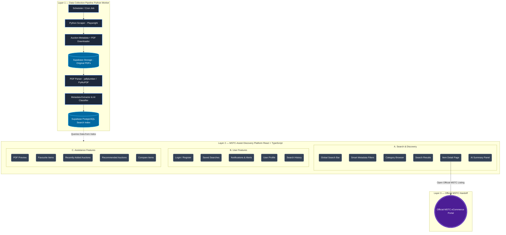

# MSTC-Assist Enterprise Architecture

This document defines the canonical system architecture and user workflow for the **MSTC-Assist** platform. 

Unlike a traditional e-commerce or bidding application, this architecture strictly positions the project as an **AI-powered discovery assistant and search engine**. It continuously indexes public data and elegantly funnels users back to the official ecosystem for legal and financial transactions.

## Enterprise Architecture Diagram

## Architecture Layer Breakdown

### Layer 1: Data Collection Pipeline (Backend Worker)
This is a completely isolated, headless Python environment. It acts as the engine of the platform. Its sole responsibility is to operate on a background cron schedule, scrape new listings from the official MSTC site, download their dense PDF catalogues, and use programmatic parsing tools (`pdfplumber`) to extract structured data (brands, models, quantities, reserve prices). The extracted data is stored cleanly inside a PostgreSQL Search Index (Supabase), completely divorcing the raw PDF from the end-user.

### Layer 2: MSTC-Assist Discovery Platform (React + TypeScript)
This is the user-facing Single Page Application (SPA). **It does not scrape data and it does not parse PDFs.** It simply connects to the Supabase Search Index API to display the pre-processed data instantly. This layer focuses entirely on User Experience (UX)—providing lightning-fast global searches, highly specific smart filters, saved alerts, and AI-generated text summaries that prevent users from having to read long, unformatted PDFs.

### Layer 3: Official MSTC Handoff
This layer represents the hard boundary of our application. We are an assistant, not a broker. Once the user utilizes our platform to successfully discover and research an auction lot they are interested in, they click a Call-to-Action button on our `Item Detail Page`. This safely redirects them directly to that item's page on the official MSTC portal, where they must log in to submit Earnest Money Deposits (EMD) and place live bids.
